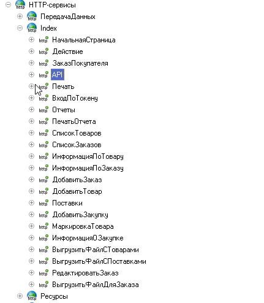
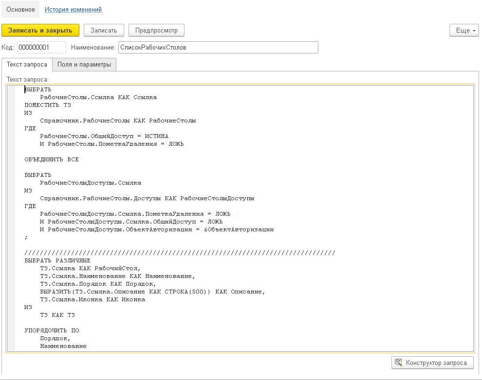
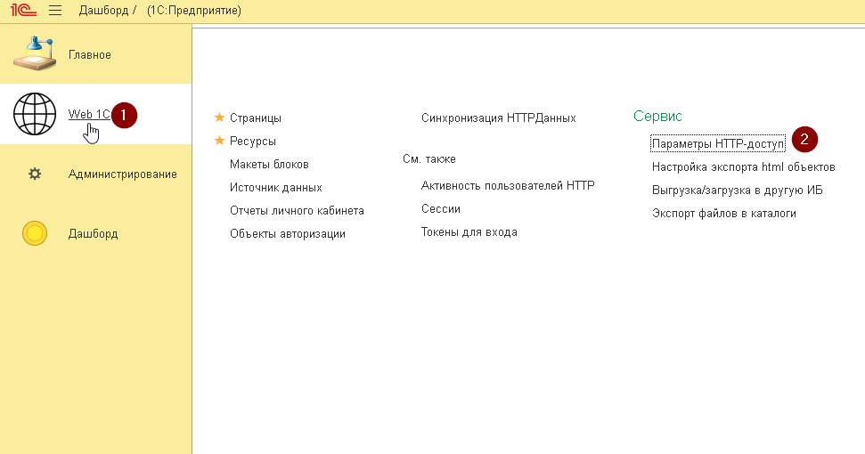

# Web 1C

## Зміст:

1. [Опис](#опис)
2. [Інтеграція](#інтеграція)
2. [Публікація](#публікація)
3. [Авторизація](#авторизація)
4. [Бекенд](#бекенд)
5. [Сторінки](#сторінки)
6. [Компоненти](#компоненти)
7. [Ресурси](#ресурси)
7. [Звіти](#звіти)
8. [Експорт ресурсів](#експорт-ресурсів)
9. [Налаштування](#налаштування)
10. [Обмін між базами](#обмін-між-базами)
11. [Завантаження проєкту](#завантаження-проєкту)

## Опис

Підсистема 1С, яка дозволяє реалізувати зручний веб-клієнт для будь-якої конфігурації, який буде відповідати наступним вимогам:

* Зручний інтерфейс і можливість використовувати всі можливості вебу
* Швидке завантаження
* Авторизація
* Використовувати лише наявну 1С-інфраструктуру


В каталозі extFiles містяться наступні файли:

1. [Web1C.cf - основна підсистема](extFiles/Web1C.cf)
2. [Web1C_SB.cf - Web1C, яка інтегрована в BAS SB](extFiles/Web1C_SB.cf)
3. [Web1C_SB.dt - Web1C, яка інтегрована в BAS SB](extFiles/Web1C_SB.dt)
4. [Web1C_files.xml - файли для Web1C, яка інтегрована в BAS SB](extFiles/Web1C_files.xml)
5. [dashboard.cf - конфігурація для конструювання показників](extFiles/dashboard.cf)
6. [dashboard.dt = конфігурація для конструювання показників](extFiles/dashboard.dt)


## Інтеграція

Підсистема Web1C складається із двох вкладених підсистем:

* `core` - ядро підсистеми
* `customization` - винесені об'єкти, які доповнються для конретної цільової конфігурації

Для першого впровадження потрібно під час об'єднання відмітити об'єкти усіх підсистем.
Під час встановлення оновлень, потрібно завантажувати лише зміни по об'єктам підсистеми `core`

## Публікація

Особливість даної підсистеми в тому, при публікації потрібно вказувати примусово авторизацію під користувачем. Це зроблено для того, щоб було доступне красиве і зрозуміле вікно авторизації, а не віконце, що нижче.


Також, є велика ймовірність, що користувач, який буде авторизуватись, не буде мати Користувача ІБ і буде зв'язаний іншими довідниками. Тому я вибрав такий спосіб.

Пару рекомендацій для користувача, під яким буде опубліковано:

* Користувач не має бути обмежений RLS або ж ці обмеження мають бути загальні для всіх зовнішніх користувачів. Додаткові обмеження краще в запитах для бекенду писати
* Користувач не повинен мати можливість запустити будь-який клієнт. Якщо веб-сервер буде скомпрометовано, то зловмисник не зможе нанести великої шкоди
* Звісно, що не потрібно давати Повні права і права адміністрування. В демці не так, але на то вона і демка

Ім'я користувача, під яким публікуватимете потрібно тримати в секреті і використовувати взагалі набір символів, як для пароля(xh8xhgf8). Бо якщо спробувати авторизуватись під користувачем 5 разів із невірним паролем, то за стандартних налаштувань 1С блокує вхід на декілька хв і публікація відповідно не працюватиме, бо при кожному зверненні йде аутентифікація.

## Авторизація

Основний принцип - потрібно дізнатись, чи це конкретне підключення має право на роботу з даними. Класична авторизація - хешована строка, jwt-токен, GUID і т.д. отримуються від сервера, зберігаються в браузері в куках чи storage і потім кожен передаються при запитах до серверу в заголовках.

Тут реалізувано так.

***Перевірка***

При кожному запиту до http-сервісу перевіряється
В заголовках має бути кукі з іменем hash_login
Значення повинне бути в РС "Сесії"
Запис в регістрі не має бути прострочений чи не активний
Якщо умови перевірки не спрацювали, то
формується структура з даними користувача сайту
Для сторінок повертається редірект на сторінку авторизації
Для апі - структура відповіді з помилкою
Якщо все ок - далі йде алгоритм обробки

***Login***

Із вхідних даних у форматі formdata витягую логін і пароль
По довіднику "Об'єкти авторизації" шукаю відповідний елемент, де
* Збігаються логін і пароль (паролі потрібно зберігати в захешованому вигляді)
* Збігаються логін і хеш переданого паролю 
* Є користувач із довідника "Користувачі", який вказаний в об'єкті авторизації і пов'язаний із ним Користувач ІБ, в якому назва і хеш паролю збігається із переданими
* Ну і звісно можна прописати будь-яку логіку
Якщо авторизовано - генерується УІД і додається запис в рс "Сесії"
В заголовки відповіді додається через "Set-Cookie" hash_login із згенерованим УІД а часом його дії

***Logout***

В заголовках шукаємо кукі з іменем hash-login
По значенню в рс "Сесії" шукаємо запис
І дезактивуємо його
Також можна додати очистку/видалення даного кукі в заголовках

***Реєстрація не реалізована***

Спочатку для авторизації я використовував довідник "Пользователи", в який додавав потрібні мені реквізити. В підсумку це був хибний шлях і в наступній реалізації був створений окремий довідник "Об'єкти авторизації" для даної підсистеми, який буде містити всю необхідну інформацію про користувача сайту, яка потім буде заповнюватись в структуру даних користувача.

Але зрештою авторизацію можливо цілком реалізувати.

## Бекенд

Опис розділю на дві частини - генерація сторінок і безпосередньо апі.

### Рендеринг

В цій підсистемі використано підхід SSR(Server Side Rendering) - серверна генерація сторінок - якраз для того, щоб уникнути використання сторонніх фронтент-фреймворків.

Перед початком реалізації потрібно визначитись з бізнес-логікою, скільки сторінок має бути і розробити їхню верстку. Після того, як це буде готово - завантажити файли проекту в систему, тобто спершу Ресурси, а потім Сторінки. Це буде описано пізніше.

Ну і потім під кожну сторінку треба створити в http-сервісі Index(у вас він може називатись як завгодно і в теорії в одній базі можна декілька клієнтів розгорнути) шаблони із методом GET під кожну сторінку. Код обробки шаблону для сторінок в цілому однаковий:

Перевіряємо, чи користувач авторизований 
Якщо так - збираємо додаткову інформації, яка може знадобитись для наповнення сторінки
* Якщо сторінка замовлення, то по ІД шукаємо замовлення, зберігаємо його в параметри, які передаються в процедуру формування сторінки
* Якщо не авторизований, то повертаємо сторінку авторизації і запам'ятовуємо куди користувач хотів, щоб потім його перенаправити




### API

Одним із шаблонів http-сервісу є api, який може приймати GET POST запити. Це в моєму випадку і є способом взаємодії між фронтом і конфігурацією.

Передаються дані у форматі formData, одним з параметрів яких є method, де потрібно вказати що саме хочемо зробити. А в самому обробнику запиту прописуємо функції для обробки потрібних нам методів апі.

В результаті отримуємо json у форматі:

```json
{
  result: '',
  error: ''
}
```
де в залежності від того, що буде заповнено, на фронті буде відповідна обробка.


Зараз деякі моменти можуть бути заплутані, але коли опишу фронтенд частину дещо проясниться.

## Сторінки


По суті - це фронт вашого проекту - тобто візуальна частина нашого проекту. Я вже наголошував, що перед впровадженням потрібно мати верстку проекту - от на цьому етапі вже потрібно займатися інтеграцію цього в проект.

Зміст сторінки можна поділити на 2 частини: 

* Фіксовану - це інформація, яку зразу можна вказати і вона змінюватися не буде.
* Динамічну - це частина, яка буде наповнюватися даними з БД і це реалізовано за допомогою компонентів

Раніше описував, що  в http-сервісах потрібно прописати, яку сторінку потрібно повернути. Там же після перевірки активності сесії, можна визначити певний набір даних/параметрів, які потрібні для формування динамічної частини. Потім ці параметри використовуються при компілюванні блоків, які включено до цієї сторінки. 
Тому, якщо коротко:
1. в коді сервісу визначаємо параметри, які потрібні для генерації сторінки, 
2. впевнюємось, що блок використовує ті ж самі вхідні параметри
3. вбудовуємо блок на сторінку
4. далі воно все само
5. за необхідністю - повторити


В сторінку ми можемо включити стилі скрипти, які будуть підключені в html-сторінці в блоці `<head>` або `<body>`. В залежності від того, вивантажений ресурс чи ні - формується лінк на нього, тому це теж варто пам'ятати.


Безпосередньо на сторінку можна вбудувати ресурс або вставити блок за допомогою командної панелі.


Розробка або інтеграція зводиться до наступного - вносите зміни в код сторінки, зберігаєте і в браузері поруч зразу ж перевіряєте ці зміни.

Рекомендації по розробці:

* Створити як мінімум "Початкову сторінку", "Сторінка авторизації", "Сторінка 404"
* Визначатись із списком сторінок, які будуть у проекті і додати це в перелічення "Види сторінок"
* Поступово додавати їх у проект.

## Компоненти

По своїй суті - це шаблонізатор, основна функція якого повернути валідний html-код із реальними даними із БД.

Тут воно поділено на "Джерела даних" і "Макети блоків"

**Джерела даних**

Це довідник, в якому описується:

* Запит - просто текст запиту
* Параметри - можна вказати значення для перевірки чи певний вираз
* Поля - описується з чого буде складатися результат запиту. Для зручності деякі значення можна оформити Форматом




**Компоненти**

А це довідник, в якому можна конструювати блок разом із джерелами даних, щоб на виході можна було отримати щось схоже на компонент. З чого він складається:

**Вхідні параметри**

 Це певний набір параметрів, які очікуємо отримати на вхід, щоб потім можна було їх прокинути в джерело даних, а там відповідно в запит або ж використати в алгоритмі
Прописуючи параметри, потрібно розуміти, що вони повинні визначатись в  http-сервісі відповідної сторінки, де буде вставлятися даний макет
Для параметра можна вказати "Значення для перевірки", яке використовуватиметься під час перевірки макету на працездатність

**Конструктор**

Це набір елементів конструктора, кожен з яких може формуватись різним чином і повертають текст
Результати елементів потім конкантенуються і повертається загальний текст макету

**Елемент конструктору**

* Назва елементу - унікальна назва конкретного блоку, яка повинна його однозначно ідентифікувати
* Джерело даних - поле з довільним типом, де потрібно вказувати відповідне значення за потребою
* Алгоритм - текстове поле для опису алгоритму в залежності від Виду
* Вид - визначає спосіб формування елементу
* Запит - повертає текстове представлення результату запиту у відповідності до описаного алгоритму. Потрібно вказувати "Джерело даних"
* Об'єкт - повертає текстове представлення значення, яке вказане в полі "Джерело даних"
* Простий текст - просто повертає текст, який вказаний в в Алгоритмі
* Запит з обробкою результату - тут в Алгоритмі прописується код обробки, якому доступна вибірка запиту. Потрібно вказувати "Джерело даних"
* Довільний код - ну тут все і так ясно
* * Список і Значення ніяк не обробляються і я вже чесно кажучи забув, що я хотів реалізувати таким чином.
* * Для запитів після вибору джерела потрібно вказати, як заповнювати параметри. Ось тут власне нам і потрібні будуть Вхідні параметри.


*Примітка*. 
Під час редагування елементу, для його збереження зроблено окрему кнопку для зберігання, яка знаходиться внизу. На жаль одноразового натискання буває замало, тому потрібно, щоб кнопка не була із зеленим фоном.

**Перевірка**

Є кнопка, яка по даним для перевірки спробує зібрати блок і якщо все ок і помилок нема, то покаже сформований html-код.


А тепер уявімо, що нам потрібно вставити інформацію про замовлення. Шматок html у вас із демо-даними має бути, тому далі потрібно розділити той текст на складові - зазвичай воно все в окремому div, тому є шапка і підвал із фіксованим текстом, і середина, де зміст є динамічним. Далі створюєте Джерело даних і прописуєте алгоритм заповнення. Я найбільш полюбляю Запит з обробкою.


## Ресурси

Це всі інші файли, які допомагають html формуватися і взаємодіяти із сервером.
Спочатку я поділив ресурси на типи(окремі довідники)


Але на поточний момент прийшов до того, що це один довідник з різними видами:

1. Стилі
2. Скрипти
3. Картинки
4. Файли

Основні можливості:

* Ресурси можна завантажувати із файлів, а можна створювати і наповнювати вручну.
* Для текстових ресурсів контент може зберігатись як файл (підходить для мінімізованих чи обфускованих стилів і скриптів) або ж як текст - тоді буде доступний редактор для швидкого редагування. Інколи в файлах готових фреймворків використовуються символи unicode, для RTL чи чогось подібного, які не підтримуються 1С(отримати чи показати текст генерує помилку), тому зберігання як файл навіть іноді виручає.


* Ресурс має властивість "Вивантажений в мережеву папку". В залежності від її значення, по різному формується URL ресурсу для підключення його на сторінці чи в інших ресурсах. Статичні ресурси безперечно краще віддавати веб-сервером напряму, бо на кожен файл буде робитись окреме підключення до бази. Під час зміни ресурсу, дана властивість скидається автоматично.

* В ресурс можна вкладати інший ресурс за допомогою команд "Вставить изображение" чи "Вставить файл". Тоді система шукає в тексті такі вставки і в залежності від того, вивантажений вкладений ресурс в мережеву папку чи ні - генерує для нього відповідне посилання.
**Важливо самому контролювати, який ресурс вивантажений**. Для прикладу, якщо десь використовувалась картинка і все було вивантажено в папку, то скрізь прописано посилання на мережеву папку. І якщо потім картинка буде змінена, то у вивантажені ресурси буде підтягуватись попередня вивантажена версія картинки.

* Для зручного редагування css та js інтегровано редактор коду Monaco, що дуже допомагає при розробці.

## Експорт ресурсів

Щоб завершити тему ресурсів, потрібно розкрити тему експорту ресурсів.

Як ви вже зрозуміли, ресурси - це по суті статичні файли і їх може віддавати 1С через запити http-сервісів або і веб-сервер(IIS, Apache). Для цього й потрібен експорт ресурсів в каталоги на веб-сервері.

Але спочатку потрібно вказати, куди вивантажувати і як потім до них достукатись. Це робиться в регістрі "Настройки експорту html-об'єктів".


Для кожного виду ресурсу потрібно вказати:

* Мережевий каталог - це каталог, доступний для веб-сервера, де буде зберігатись конкретний вид ресурсу
* Повний мережевий шлях - повний URL до каталогу, до якого потім буде додаватись назва відповідного ресурсу і в результаті отримаємо повний шлях
* Частковий мережевий шлях  - схоже на попередній, тільки не вказується адреса

**В новій базі потрібно заповнити регістр для видів ресурсу.**

Експорт робиться однойменною обробкою "Експорт файлів"


Обробка по суті проста:

1. Вибираємо, що саме хочемо експортувати
2. Далі можна вибрати експортувати все, чи лише змінені
3. Підбір ресурсів
4. Експорт

В разі успішного експорту, в ресурс ставиться помітка "Вивантажений в мережевий каталог"

## Звіти

Цей елемент підсистеми на мою думку не є до кінця доробленим механізмом, однак працює.

Основою для звітів є підсистема БСП "Варіанти звітів". Можна реалізувати також на основі будь-якої схеми компоновки даних, але мені лінь було :)

**Особливість** звітів на даному етапі полягає в тому, що показати дані в звіті для конкретного користувача/клієнта можна лише вказавши його в параметрах СКД. Я почав був додавати відбори та поки що цей момент не є реалізованим.


Для звіту вказати:

* Варіант звіту
* Заповнити параметри із звіту і ввибрати варіанти їхнього заповнення
  * В особистому кабінеті - підсистема самостійно сформує поля для звіту. Підтримуються типи:
    * Строка
    * Число
    * Дата
    * Булево
    * Стандартний період
  * Із внутрішніх параметрів
  * Конкретне значення
* Налаштувати доступ
  * Загальний доступ
  * Або ж увімкнути доступ конкретним Об'єктам авторизації

**Пареметри звіту**


В режимі Web1C при формуванні звіту можна обрати варіант отримання звіту - класичний Html або ж Pdf.


## Налаштування

Параметрів в підсистемі насправді не багато, але про них варто згадати. До них відноситься:

* Ім'я публікації
* Повна адреса публікації

### Ім'я публікації

Даних параметр дуже важливий, оскільки підсистема не знаю, під яким іменем буде зроблена публікація, а прописувати відносні адреси в браузері (/щось_там/щось_тут) без знання цього неможливо. Тому після публікації потрібно це вказати. Вказується у форматі "<Ім'я публікації>/hs". "hs" вказую для того, щоб не морочитись в коді з підстановкою, а зразу починаю із імен сервісів.

### Повна адреса публікації
Даний параметр потрібний при генерації токенів доступу, адже там потрібно згенерувати повне посилання для доступу, а не відносну його частину і для цього потрібно знати, за якою адресою буде доступна публікація.




## Обмін між базами

Всі ж знають, що на проді (бойовій, робочій базі) зміни потрібно вносити вже відтестовані і коректні. Те ж стосується і Web-1С. Тому з часом я задумався над тим, щоб якось полегшити собі перенос змін між базами. В результаті й вийшла ця обробка.


В процесі покращення обробка отримала 2 варіанти вивантаження:  

* Ручний порядок
* Вивантаження по плану обміну

### Ручний порядок  
В цьому режимі ви мишкою можете перетягувати те, що хочете в включити в пакет обміну. Під час перетягування йде підбір пов'язаних об'єктів і пропонує вибрати, що відправити на додачу до вибраного об'єкту. Тому всі зв'язки вам пам'ятати не потрібно. Якщо вказати "Вивантажувати всі пов'язані об'єкти", то пошук буде йти рекурсивно по підібраним об'єктам.


### Вивантаження по плану обміну. 
Для цього потрібно спершу створити вузли в плані обміну "Синхронізація HTTP-даних", після того при зміні сторінок, ресурсів, блоків, джерел даних - на вузлах будуть фіксуватись, які об'єкти змінились і буде можливість швидко отримати лише ті об'єкти, які змінились. Також є команда по очистці змін на вузлах - це відбувається лише вручну і про це варто не забувати.


### Завантаження даних
Ну тут все дуже просто - вибрали файл і натиснули кнопку

### Резюме
На завершення хочу додати, що описаний вище спосіб підійде для випадку, коли одна база розробки -> 1+ база проду. Виникла ідея для реалізації обміну для можливості вести розробку декількома програмістами, але в мене такої ситуації не було (я завжди сам розробляв), та й це треба трохи заморочитися і реалізувати якусь систему версій.

## Завантаження проєкту

Отримуючи готову верстку для майбутнього особистого кабінету, інколи може постати питання, як швидко додати ресурси? Адже деякі проекти, особливо на Bootstrap може містити доволі велику кількість допоміжних файлів і вручну їх вносити нудно. 

Тому й була додана така опція для Ресурсів, куди можна згодувати каталог з ресурсами і система перенесе ресурси, створивши ідентичну структуру по каталогам.


